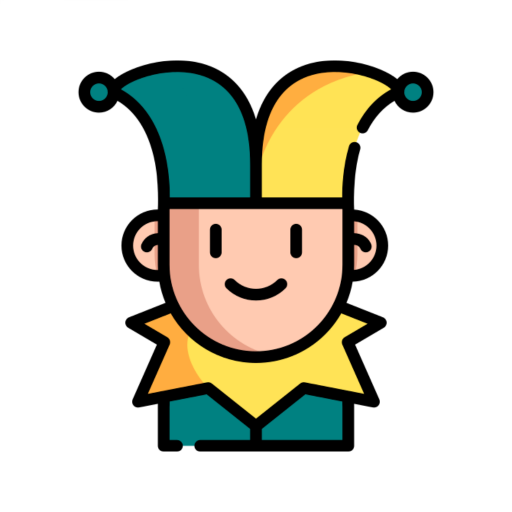

# Joke App

Joke App is a iOS app written in swiftUI with Combine and only one dependency extra called Lottie for animations installed with swift package manager.

## Global concepts

- @EnvironmentObject: global state management
- @ObservedObject: View model for handle API request

## Structure
- AppSettings file: global static data of the app (like primary color)
- Store file: global Observable app state
- Extensions file: swift global extensions for reuse
- ContentView File: Start point of the app
- Components folder: reusable views
- Screens folder: screens views
- Navigation folder: tabview handle
- Models folder: handle jokes codeable and ObservableObject
- Lottie folder: animation json code for Lottie library
- Services folder: handle de API calls

## Requisites

- Xcode 12.4

## Usage
Open the project (Joke book file with blue icon) and run on any simulator (the recommended way is on real device)
